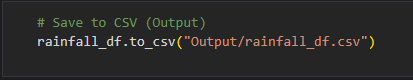
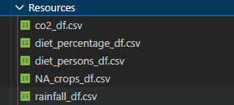
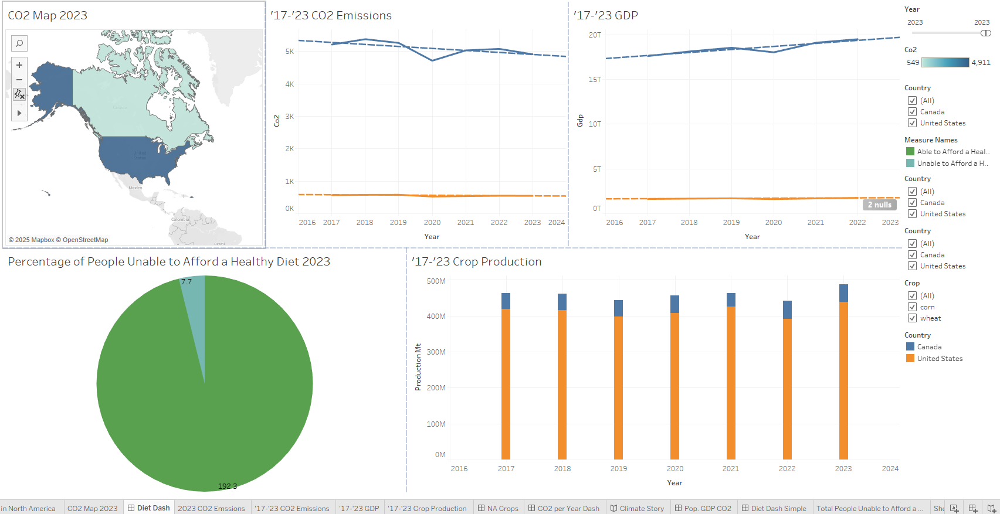
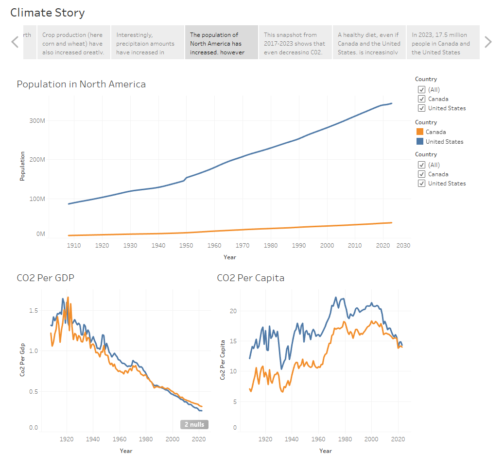

# README for Tableau Climate Project

## Introduction

This Tableau presentation visualizes climate data in North America (specifically Canada and the United States). The project was created using real world publicly accessible data. It looks at many parameters, including: rainfall, CO2 emissions, GDP, healthy diet data, and crop yields.

This project uses data cleaned an prepared from the a previous project (climate_agriculture_impact), available at: [https://github.com/nickbartram/climate_agriculture_impact](https://github.com/nickbartram/climate_agriculture_impact). Please visit the aforementioned repository for details concerning research, collection, and data processing.

## Data

The data for this project comes from several different sources:

First a very large dataset from Our World in Data (OWID: https://ourworldindata.org/) the shows global CO₂ emissions since the year 1750. This contains data from every country in the world, it's a large CSV file that was downloaded directly from the site (full citation in [References](#references)).

The next dataset comes from the Food and Agriculture Organization and World Bank (World Bank: https://data.worldbank.org/). This dataset shows the affordability of a healthy diet globally. It shows how many people are able to afford a healthy diet in each country. This was another CSV file downloaded directly from the site (full citation in [References](#references)).

The next dataset also comes from the World Bank but also the Climate Change Knowledge Portal (CCKP: https://climateknowledgeportal.worldbank.org/). This CSV was obtained through an API request, looking for a timeseries of annual rainfall from 1908-2024. The specific API request in found in the `main_backup.ipynb` or `CCKP_rainfall_data.ipynb` notebooks of this repo. A full citation come be found in [References](#references).

Finally datasets of crop production of Canada and the United States of America were found at Statistics Canada (Stats Can: https://www.statcan.gc.ca/en/start) and the United States Department of Agriculture Quick Stats (USDA Quick Stats: https://www.nass.usda.gov/Quick_Stats/). These two datasets contains information on historical wheat and corn production that was used for this project. A full citation come be found in [References](#references).

This is the same data used in two other projects for this portfolio. The other projects are avaible here:

* [https://github.com/nickbartram/climate_agriculture_impact.git](https://github.com/nickbartram/climate_agriculture_impact.git)
* [https://github.com/nickbartram/flask_app](https://github.com/nickbartram/flask_app)

## Methodology

Unlike the other two projects in this portfolio, this Tableau presentation does not use the PostgreSQL database. Instead, the tables in that database were exported as CSV files and loaded to Tableau directly.

Example:

      

Tableau can connect to a PostgreSQL database however, that requires a subscription. The cost of the subsciption was prohibitive considering the scale of this project. The database is static as well, it will not change, therefore having a live connection was unnecessary.

First, worksheets were created, then dashboards, and finally a Tableau story combining all the elements. Many different worksheets were tested and customized, not all of them were used in the final story.

## Results

The visuals in this project demonstrate some interesting trends:

* CO2 emissions in Canada and the United States have greatly increased since the 1960s however, emissions have dropped somewhat in the last 15 years.
* Wheat and corn production has steadily increased in both countries, though fluctuating from year to year the overall trend increases greatly
* Rainfall in the United States is much higher than Canada, even though Canada has a much larger surface area.
* Population in the both countries has also greatly increased, although CO2 per capita has been decreasing since the year 2000.
* With crop production, rainfall, CO2 all increasing, it's surprising to see that people able to afford a healthy diet is decreasing.
  * There's more food, but less people are able to afford it.

Tableau's interactive dashboards allow the user explore these relationships over time and between countries.

Example slide from Tableau story:

## Conclusion

This project demonstrates how multiple datasets can be combined and visualized in Tableau to explore climate, agriculture and economic trends. The interactive dashboards allow users to engage with the data without needing to process CSVs or write code. While the findings are not intended to provide new scientific insights, they effectively higlight patterns and relataionshps in climate and agricultural data in North America. This project showcases skills in data preparation, visualization design and interactive storytelling using Tableau.

## References

* Our World in Data. *CO₂ Data.* Available at: [https://github.com/owid/co2-data](https://github.com/owid/co2-data)
* World Bank & FAO. *Cost and Affordability of a Healthy Diet (CoAHD).* Available at: [https://data360.worldbank.org/en/dataset/FAO_CAHD](https://data360.worldbank.org/en/dataset/FAO_CAHD)
* World Bank. *Climate Change Knowledge Portal.* Available at: [https://climateknowledgeportal.worldbank.org/download-data](https://climateknowledgeportal.worldbank.org/download-data)
* Statistics Canada. Available at: [https://www150.statcan.gc.ca/t1/tbl1/en/cv.action?pid=3210035901](https://www150.statcan.gc.ca/t1/tbl1/en/cv.action?pid=3210035901)
* USDA. *Quick Stats.* Available at: [https://quickstats.nass.usda.gov/](https://quickstats.nass.usda.gov/)

## Usage

This Tableau story uses five distinct tables rather than a single combined dataset. As a result, the dashboard controls are independent, meaning they only affect the visuals tied to their respective tables. Some slides contain a single worksheet, so controls behave as expected, while dashboards with multiple visuals may have controls that only partially interact with the displayed charts.

Explore the controls to see how they affect each worksheet or dashboard. This design choice preserves the integrity of the separate tables and avoids disrupting the underlying data.
